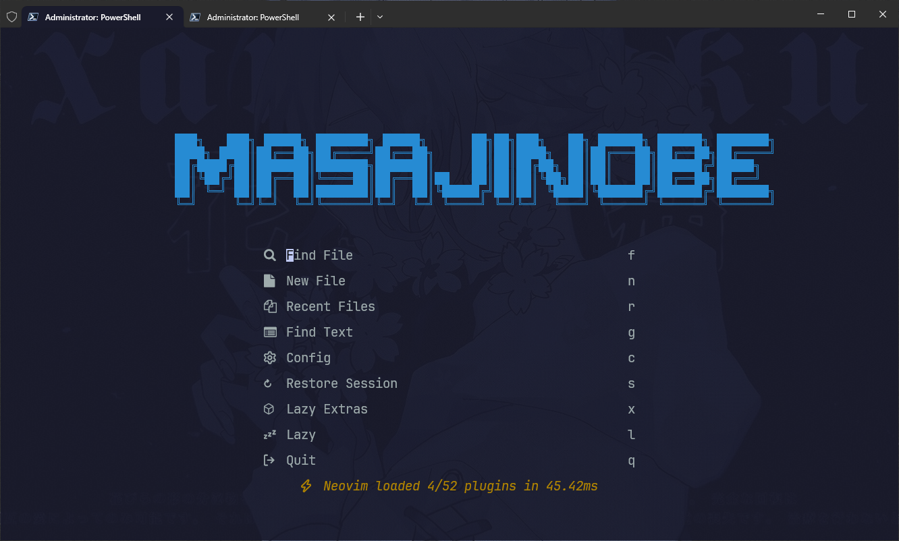
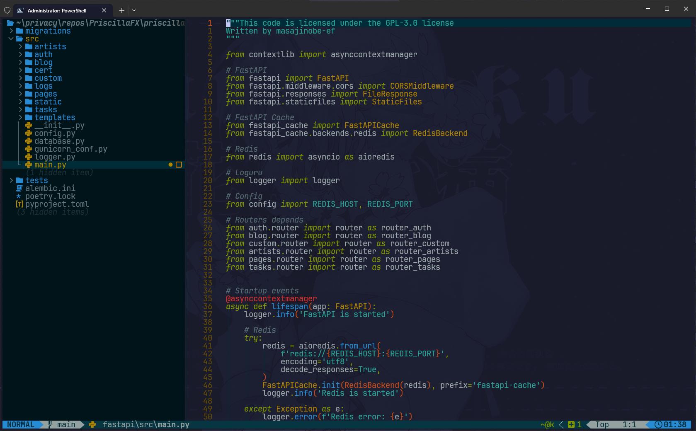

# MVim

<p align="center">
    
    
</p>

Install the MVim

Make a backup of your current Neovim files:

```sh
mv ~/.config/nvim{,.bak}

# optional but recommended
mv ~/.local/share/nvim{,.bak}
mv ~/.local/state/nvim{,.bak}
mv ~/.cache/nvim{,.bak}
```

Clone repo:

```sh
git clone https://github.com/masajinobe-ef/MVim ~/.config/nvim
```

Start Neovim!

for Windows:

```sh
# required
Move-Item $env:LOCALAPPDATA\nvim $env:LOCALAPPDATA\nvim.bak

# optional but recommended
Move-Item $env:LOCALAPPDATA\nvim-data $env:LOCALAPPDATA\nvim-data.bak

git clone https://github.com/masajinobe-ef/MVim $env:LOCALAPPDATA\nvim
```
